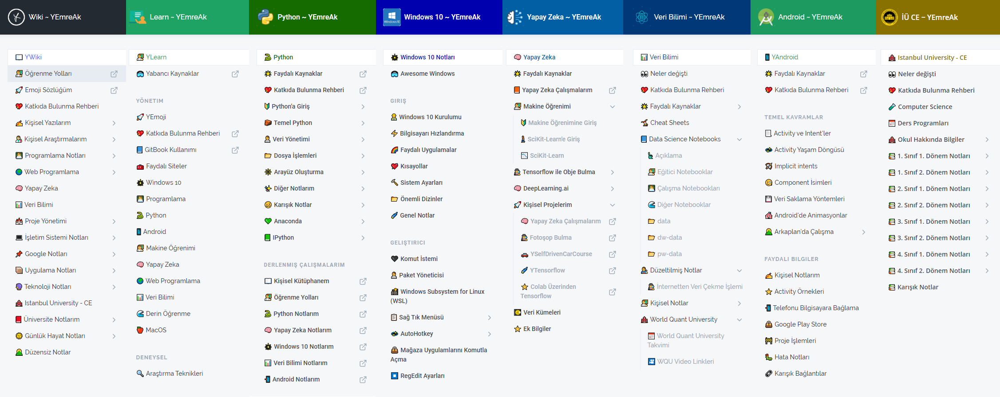

# 👨‍💻 YEmreAk

## 🦚 Karşılama

Her alanda bildiklerimi daha kullanışlı olması adına alt domainlerde saklamaktayım.

* 🏹 Sağ üstteki arama alanına aradığın sayfanın başlığını yaz
* 🕵️‍♂️ Sayfa açıldıktan sonra CTRL + F ile tarayıcı arama alanına isteğini yaz
* 🚀 Bulduğun linke tıkla ve aradığın alana yönel


**🔍** Arama alanından **tüm domainlerdeki sayfa başlıklarına** erişebilirisin


> Her sütun bir ayrı web sayfasındaki içeriği gösterir

## ✨ Sayfalarım























